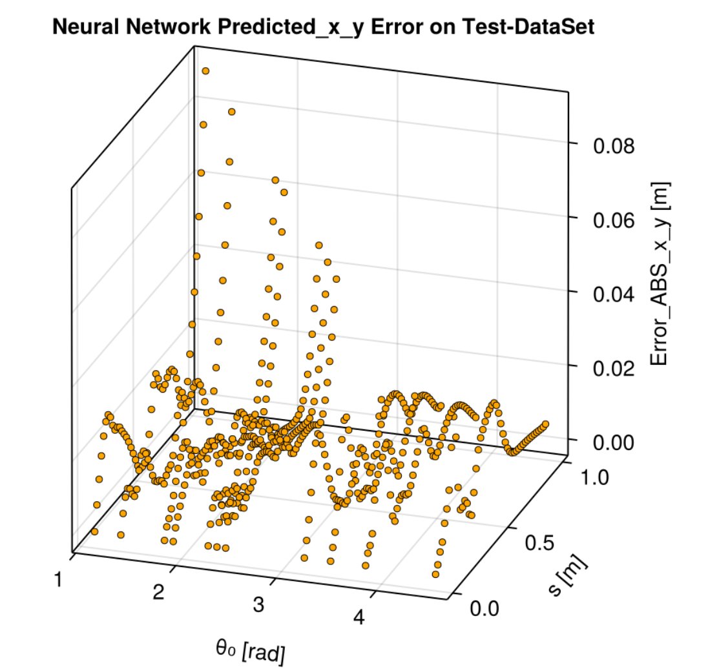

# ClampedPinnedRodUDE

[](https://julialang.org/)
[](LICENSE)

<div align="center">

</div>


A comprehensive Julia package for solving the inverse kinematics of clamped-pinned rods using **Universal Differential Equations (UDE)** and **Neural ODE** networks. This package extends traditional rod solving approaches with machine learning methodologies for enhanced accuracy and efficiency.

## 🎯 Overview

This package implements a **UDE-based approach** to solve the inverse position problem of Clamped-Pinned Cosserat beams. The system uses Neural ODE networks to learn the complex kinematics of flexible rods under various boundary conditions and rotational constraints.

### Key Features

- **🧠 Neural ODE Networks**: Deep learning approach using 1MLPx3 architecture with `tanh` activation
- **📊 UDE Methodology**: Universal Differential Equations for physics-informed machine learning
- **🔄 Inverse Kinematics**: Solves for rod configurations given end-effector positions
- **📈 Training & Prediction**: Complete pipeline from data preparation to model deployment
- **🎛️ Parameter Optimization**: Advanced optimization algorithms for ill-conditioned problems
- **📱 Visualization**: Comprehensive plotting and analysis tools
- **⚙️ Configuration Management**: Flexible parameter management system

## 🏗️ Project Structure

```
ClampedPinnedRodUDE/
├── src/
│   ├── ClampedPinnedRodUDE.jl          # Main module
│   ├── solvers/                         # Core algorithms
│   │   ├── Clamped_Pinned_Rotate_1MLPx3_Training.jl
│   │   └── Clamped_Pinned_Rotate_1MLPx3_Predict.jl
│   ├── utils/                           # Utilities and configuration
│   │   ├── config.jl                   # Configuration management
│   │   ├── project_utils.jl            # Project setup utilities
│   │   └── logging.jl                  # Logging functionality
│   └── Data/                           # Output data and models
│       ├── NN_NODE_1MLPx3_tanh_X02_R2.jld2
│       └── NN_NODE_1MLPx3_tanh_X05_R1.jld2
├── dataset/                            # Training and testing datasets
│   ├── LearnigData_Rod_Clamp_Pin_Rot_X02_Y00_*.mat
│   ├── LearnigData_Rod_Clamp_Pin_Rot_X05_Y00_*.mat
│   └── LearnigData_Rod_Clamp_Pin_Rot_X08_Y00_*.mat
├── copilotmd/                          # Documentation and optimization guides
├── resources/                          # Additional project resources
├── Project.toml                        # Package dependencies
└── Manifest.toml                       # Dependency versions
```

## 🚀 Quick Start

### Installation

1. **Clone the repository:**
   ```bash
   git clone https://github.com/jruiz125/Camped-Pinned-Rod-UDE.git
   cd ClampedPinnedRodUDE
   ```

2. **Activate the Julia environment:**
   ```julia
   using Pkg
   Pkg.activate(".")
   Pkg.instantiate()
   ```

3. **Load the package:**
   ```julia
   using ClampedPinnedRodUDE
   ```

### Basic Usage

#### Training a Neural ODE Model

```julia
# Include the training solver
include("src/solvers/Clamped_Pinned_Rotate_1MLPx3_Training.jl")

# The script will automatically:
# 1. Load training data from dataset/
# 2. Configure the neural network (1MLPx3 with tanh activation)
# 3. Train using UDE methodology
# 4. Save the trained model to src/Data/
```

#### Making Predictions

```julia
# Include the prediction solver
include("src/solvers/Clamped_Pinned_Rotate_1MLPx3_Predict.jl")

# The script will:
# 1. Load the trained model
# 2. Generate predictions for test data
# 3. Create visualization plots
# 4. Save results with timestamp
```

#### Configuration Management

```julia
# Create a rod configuration
config = ClampedRodConfig(
    L = 1.0,           # Rod length [m]
    N = 100,           # Number of discretization nodes
    EI = 1.0,          # Bending stiffness
    x0 = 0.0, y0 = 0.0, # Clamped end position
    theta = 0.0,        # Clamped end orientation [rad]
    xp = 0.5, yp = 0.0  # Pinned end position
)

# Print configuration
print_config(config)
```

## 🧮 Mathematical Foundation

The package solves the **inverse kinematics problem** for Cosserat rods using:

### Governing Equations
- **Cosserat Rod Theory**: Geometrically exact beam formulation
- **Boundary Conditions**: Clamped-pinned configuration with rotational constraints
- **Neural ODE**: `du/dt = NN(u, p, t)` where `NN` is a multilayer perceptron

### Network Architecture
- **Type**: 1MLPx3 (3-layer MLP)
- **Activation**: `tanh`
- **Input**: Current state variables `(px, py, κ, θ)`
- **Output**: State derivatives

### Training Methodology
- **Framework**: Lux.jl for neural networks
- **Optimization**: Multiple algorithms (ADAM, L-BFGS, etc.)
- **Regularization**: Advanced techniques for ill-conditioned problems
- **Data**: Multiple rotation scenarios (X02, X05, X08 positions)

## 📊 Dataset Information

The package includes comprehensive datasets with:

- **Training Data** (85%): `*_train_085.mat` files
- **Testing Data** (15%): `*_test_015.mat` files
- **Complete Sets**: `*_72sols_mode2.mat` files
- **Multiple Configurations**: X02, X05, X08 clamp positions
- **Format**: MATLAB `.mat` files with ground truth solutions

### Data Structure
Each dataset contains:
- `px(θ₀)`, `py(θ₀)`: Position coordinates as functions of rotation
- `κ₀(θ₀)`: Curvature along the rod
- `θ₀`: Rotation angle parameter

## 🔧 Dependencies

### Core Packages
- **Lux.jl**: Neural networks and deep learning
- **OrdinaryDiffEq.jl**: Differential equation solvers
- **SciMLSensitivity.jl**: Automatic differentiation
- **Optimization.jl**: Optimization algorithms
- **ComponentArrays.jl**: Structured parameter arrays

### Visualization & Data
- **Plots.jl**: Plotting and visualization
- **MATLAB.jl**: MATLAB file interface
- **JLD2.jl**: Julia data serialization

### Utilities
- **BenchmarkTools.jl**: Performance measurement
- **StableRNGs.jl**: Reproducible random numbers
- **LaTeXStrings.jl**: Mathematical notation

## 🧪 Testing

Run the test suite:
```julia
julia test/runtests.jl
```

The testing framework includes:
- Model consistency validation
- Numerical accuracy checks
- Configuration verification
- Performance benchmarks

## 📈 Performance & Optimization

### Optimization Strategies
- **Regularization**: Tikhonov, Truncated SVD, LSQR/LSMR
- **Bayesian Methods**: Advanced parameter estimation
- **Multi-threaded**: Designed for single-thread Julia environments
- **Memory Efficient**: Optimized for large-scale problems

### Benchmarking
The package includes comprehensive benchmarking tools to measure:
- Training time per epoch
- Prediction accuracy
- Memory usage
- Convergence rates

## 🤝 Contributing

We welcome contributions! Please:

1. Fork the repository
2. Create a feature branch
3. Make your changes
4. Add tests for new functionality
5. Submit a pull request

## 👥 Authors

- **José Luis Ruiz-Erezuma** - *Primary Developer* - [jruiz125@ikasle.ehu.eus](mailto:jruiz125@ikasle.ehu.eus)
- **Oscar Altuzarra Maestre** - *Research Supervisor*

**Institution**: University of the Basque Country (EHU/UPV)

## 📄 License

This project is licensed under the MIT License - see the [LICENSE](LICENSE) file for details.

## 📚 Citation

If you use this package in your research, please cite:

```bibtex
@software{ClampedPinnedRodUDE2025,
  title={ClampedPinnedRodUDE: Universal Differential Equations for Clamped-Pinned Rod Kinematics},
  author={Ruiz-Erezuma, José Luis and Altuzarra, Oscar},
  year={2025},
  institution={University of the Basque Country (EHU/UPV)},
  url={https://github.com/jruiz125/Camped-Pinned-Rod-UDE}
}
```

## 🔗 Related Projects

- **ClampedPinnedRodSolver**: Traditional analytical solver approach
- **SciML.jl**: Scientific Machine Learning ecosystem
- **DifferentialEquations.jl**: Differential equation solving framework

## 📞 Support

For questions, issues, or suggestions:
- **Email**: [jruiz125@ikasle.ehu.eus](mailto:jruiz125@ikasle.ehu.eus)
- **Issues**: [GitHub Issues](https://github.com/jruiz125/Camped-Pinned-Rod-UDE/issues)

---

*Last updated: August 31, 2025*
