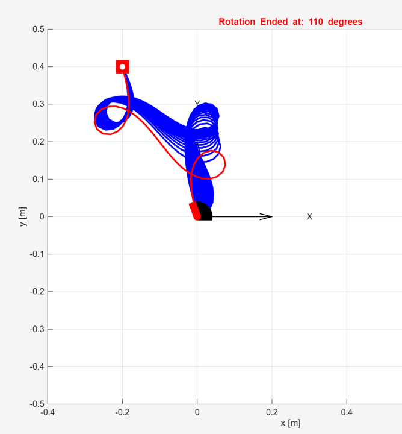

# ClampedPinnedRodSolver.jl



A comprehensive Julia package for solving the inverse kinematics of clamped-pinned rods using numerical methods.

## Overview

This package provides computational tools for:
- **Initial Rod Solver**: Inverse kinematics, using numerical methods, for Initial Rod shape
- **Rotational Rod Solver**: Generation of rotation training datasets
- **Automated Pipeline**: Automated end-to-end data generation workflow
- **Dataset Splitting**: Automated training/testing data preparation
- **Configuration Management**: Flexible parameter handling
- **Advanced Logging System**: Comprehensive pipeline monitoring
- **Figure Management**: Unified figure saving with organized directory structure

## Installation

### From GitHub (Recommended)

```julia
using Pkg
Pkg.add(url="https://github.com/jruiz125/Clamped-Pinned-Rod-Solver.git")
```

### For Development

```bash
git clone https://github.com/jruiz125/Clamped-Pinned-Rod-Solver.git
cd Clamped-Pinned-Rod-Solver
julia --project=.
```

Then in Julia:
```julia
using Pkg
Pkg.instantiate()  # Install dependencies
using ClampedPinnedRodSolver
```

## Quick Start

### Complete Pipeline (Recommended)

```julia
using ClampedPinnedRodSolver

# Setup project environment
project_root = setup_project_environment(activate_env=true)

# Create configuration
config = create_config(
    xp = 0.2,           # Target x position
    yp = 0.0,           # Target y position
    mode = 2,           # Buckling mode
    train_ratio = 0.85, # 85% training, 15% testing
    save_figures = true, # Enable figure saving
    capture_all_output = true, # True: Complete REPL capture including all stdout/stderr output
)

# 📖 FUNCTION DOCUMENTATION & HOVER SUPPORT

# Due to MATLAB dependency conflicts, function hover/IntelliSense may not work
# properly in this file. For full documentation with hover support:
#
# 1. Open: src/utils/docs_for_language_server.jl
# 2. Hover over function names for complete documentation
# 3. This file contains all function signatures without MATLAB dependencies
#
# Auto-open documentation file (uncomment if VS Code is your editor):
run(`code "src/utils/docs_for_language_server.jl"`)

println("📖 For function documentation with hover support:")
println("   Open: src/utils/docs_for_language_server.jl")
println("   This file provides full IntelliSense without MATLAB conflicts")

# Run complete 3-step pipeline:
    # 1. Generate initial rod shape (initial_rod_solver)
    # 2. Generate rotation learning data (clamp_fixed_rod_solver) 
    # 3. Split dataset for training/testing (dataset_splitter)
success = solve_and_prepare_data(config)

if success
    println("✅ Pipeline completed successfully!")
    println("📊 Training/testing datasets ready for machine learning")
    println("📁 Check dataset/MATLAB code/Learning_Data_ClampedPinned_Rod_IK/Learning DataSet/")
else
    println("❌ Pipeline failed - check logs for details")
end
```

### Individual Steps

```julia
# Step 1: Generate initial rod shape
success1 = initial_rod_solver(config)

# Step 2: Generate rotation learning data (72 trajectories)
success2 = clamp_fixed_rod_solver(config)

# Step 3: Split dataset into training/testing sets
success3 = split_dataset_for_training(config)
```

### Advanced Configuration

```julia
# Configuration with advanced options
config = create_config(
    xp = 0.3,                        # Target position
    yp = 0.1,                        
    mode = 2.0,                      # Buckling mode
    save_figures = true,             # Enable figure saving
    figures_base_path = "results",   # Custom figure directory
    figure_format = "pdf",           # High-quality PDF output
    figure_dpi = 600,                # High resolution
    train_ratio = 0.8,               # 80% training, 20% testing
    sol_number = 1                   # Solution selection
)

# Run with complete output logging
success = solve_and_prepare_data(
    config, 
    enable_logging = true,
    capture_all_output = true,  # Capture all MATLAB output
    log_dir = "analysis_logs"   # Custom log directory
)
```
```

## Examples

### Example 1: Complete Pipeline Usage
```julia
# Create configuration for position (0.4, 0.15)
config = create_config(xp = 0.4, yp = 0.15, mode = 2)

# Run complete pipeline with logging
success = solve_and_prepare_data(config, enable_logging=true)

# Files generated:
# 1. Initial rod shape: CLampedPinnedRod_sol_1_mode_2_X04_Y15.mat
# 2. Full dataset: LearnigData_Rod_ClampedPinned_Rotated_X04_Y15_mode2_72sols.mat
# 3. Training set: LearnigData_Rod_ClampedPinned_Rotated_X04_Y15_mode2_train_085.jld2/.mat
# 4. Testing set: LearnigData_Rod_ClampedPinned_Rotated_X04_Y15_mode2_test_015.jld2/.mat
```

### Example 2: Multiple Position Analysis
```julia
# Define arrays of positions to analyze
xp_values = [0.1, 0.2, 0.3, 0.4, 0.5]
yp_values = [0.0, 0.05, 0.1, 0.15]

# Analyze each position with complete pipeline
results = Dict()
for xp in xp_values, yp in yp_values
    config = create_config(xp = xp, yp = yp, mode = 2)
    success = solve_and_prepare_data(config, enable_logging=true)
    results[(xp, yp)] = success
    
    if success
        println("✅ Completed analysis for position ($xp, $yp)")
    else
        println("❌ Failed analysis for position ($xp, $yp)")
    end
end

# Summary
successful = sum(values(results))
total = length(results)
println("📊 Analysis complete: $successful/$total positions successful")
```

### Example 3: Custom Logging and Output Control
```julia
# Configuration for detailed analysis
config = create_config(xp = 0.2, yp = 0.0, mode = 2, train_ratio = 0.9)

# Option 1: Selective logging (pipeline events only)
success = solve_and_prepare_data(config, 
    enable_logging = true,
    capture_all_output = false  # Default - structured logging only
)

# Option 2: Complete REPL capture (includes all MATLAB output)
success = solve_and_prepare_data(config, 
    enable_logging = true,
    capture_all_output = true   # Captures everything including MATLAB engine
)

# Option 3: No logging (console output only)
success = solve_and_prepare_data(config, enable_logging = false)

# Option 4: Custom log directory
success = solve_and_prepare_data(config, 
    enable_logging = true,
    log_dir = "project_analysis_logs"
)
```

### Example 4: Dataset Analysis and Verification
```julia
using JLD2

# Generate data
config = create_config(xp = 0.3, yp = 0.1, mode = 2, train_ratio = 0.85)
success = solve_and_prepare_data(config)

if success
    # Load and analyze generated datasets
    base_name = "LearnigData_Rod_Clamp_Pin_Rot_X03_Y01_mod2"
    train_path = "dataset/MATLAB code/Learning_Data_ClampedPinned_Rod_IK/Learning DataSet/$(base_name)_train_085.jld2"
    test_path = "dataset/MATLAB code/Learning_Data_ClampedPinned_Rod_IK/Learning DataSet/$(base_name)_test_015.jld2"
    
    # Load datasets
    train_data = load(train_path, "DataSet_train")
    test_data = load(test_path, "DataSet_test")
    
    println("📊 Dataset Analysis:")
    println("  Training set: $(size(train_data, 1)) trajectories × $(size(train_data, 2)) points")
    println("  Testing set:  $(size(test_data, 1)) trajectories × $(size(test_data, 2)) points")
    println("  Total trajectories: $(size(train_data, 1) + size(test_data, 1))")
    
    # Verify split ratio
    total_trajectories = size(train_data, 1) + size(test_data, 1)
    actual_train_ratio = size(train_data, 1) / total_trajectories
    println("  Actual train ratio: $(round(actual_train_ratio, digits=3))")
    println("  Expected train ratio: $(config.train_ratio)")
end
```
## Complete Pipeline Architecture

The package implements a **3-step automated pipeline** for complete data generation:

### Pipeline Overview
```
Input: Configuration (xp, yp, mode, train_ratio, etc.)
    ↓
┌─────────────────────────────────────────────────────────────┐
│ STEP 1: Generate Initial Rod Shape                          │
│ • initial_rod_solver()                                      │
│ • Solves inverse kinematics using numerical methods         │
│ • Generates: CLampedPinnedRod_sol_X_mode_Y_ZZZ.mat          │
│ • Creates: Initial rod shape figures                        │
└─────────────────────────────────────────────────────────────┘
    ↓
┌─────────────────────────────────────────────────────────────┐
│ STEP 2: Generate Rotation Learning Data                     │
│ • clamp_fixed_rod_solver()                                  │
│ • Rotates clamp through 360° (72 trajectories)              │
│ • Generates: LearnigData_Rod_ClampedPinned_Rotated_*.mat    │
│ • Creates: Motion analysis figures (9 plots)                │
└─────────────────────────────────────────────────────────────┘
    ↓
┌─────────────────────────────────────────────────────────────┐
│ STEP 3: Split Dataset for ML Training                       │
│ • split_dataset_for_training()                              │
│ • Splits data according to train_ratio                      │
│ • Generates: *_train_*.jld2/.mat & *_test_*.jld2/.mat       │
│ • Ready for machine learning workflows                      │
└─────────────────────────────────────────────────────────────┘
    ↓
Output: Ready-to-use training/testing datasets + comprehensive figures
```

### Key Features
- **🔄 Automated Execution**: Single function call runs entire pipeline
- **📝 Comprehensive Logging**: Track every step with detailed logs
- **🛡️ Error Handling**: Robust error recovery and status reporting
- **📊 Data Validation**: Automatic verification of generated datasets
- **🎨 Figure Management**: Organized figure saving with unified directory structure
- **⚙️ Flexible Configuration**: Extensive customization options

## Logging System

The package includes a comprehensive logging system with **flexible capture modes**:

### **Logging Modes**
- **Selective Logging** (default): Captures only pipeline steps and results
- **Complete REPL Capture**: Captures ALL stdout/stderr including MATLAB engine output
- **Enable/Disable**: Full control over logging activation

### **Usage Examples**
```julia
# Selective logging (default) - only pipeline events
success = solve_and_prepare_data(config, enable_logging=true)

# Complete REPL capture - all output including MATLAB engine
success = solve_and_prepare_data(config, enable_logging=true, capture_all_output=true)

# Disable logging completely - normal console output only
success = solve_and_prepare_data(config, enable_logging=false)

# Custom log directory with complete capture
success = solve_and_prepare_data(config, enable_logging=true, log_dir="my_logs", capture_all_output=true)
```

### **Selective vs Complete Capture**

**Selective Logging (`capture_all_output=false`)**:
- Configuration parameters and system information
- Pipeline step execution with timestamps
- Function execution times and success/failure status
- Generated file locations and names
- Error messages and details (if any)
- Summary of all created files

**Complete REPL Capture (`capture_all_output=true`)**:
- Everything from selective logging PLUS
- All MATLAB engine output and communications
- Complete function execution details
- All stdout/stderr output during execution
- Raw solver iteration data
- Complete debugging information

### **Log File Location**
```
logs/RodSolver_X{X}_Y{Y}_mode{M}_{timestamp}.log
```

### **Log File Structure**
```
================================================================================
ROD SOLVER PIPELINE LOG
================================================================================
Log file: logs\RodSolver_X02_Y00_mode2_20250822_143052.log
Start time: 2025-08-22T14:30:52.123
Julia version: 1.11.1
Working directory: c:\Users\josel\MATLAB\Projects\ClampedPinnedRodSolver
================================================================================
CONFIGURATION PARAMETERS:
================================================================================
ClampedRodConfig(...)
================================================================================
PIPELINE EXECUTION LOG:
================================================================================
[2025-08-22 14:30:52] COMPLETE ROD SOLVER PIPELINE
[2025-08-22 14:30:52] STEP 1: Generating initial rod shape...
[2025-08-22 14:30:53] 🔄 Starting initial_rod_solver...
[2025-08-22 14:32:15] ✓ initial_rod_solver completed successfully (Duration: 82.5s)
...
================================================================================
PIPELINE COMPLETED
End time: 2025-08-22T14:35:22.456
================================================================================
```

### **Benefits**
- **Optional**: Use only when you need detailed records
- **Performance**: No impact when disabled
- **Flexibility**: Choose when and where to log
- **Debugging**: Complete execution context when needed
- **Batch Processing**: Log only important runs, skip routine executions

### **Usage Examples**
```julia
# Default logging to logs/ directory
success = solve_and_prepare_data(config)

# Custom log directory
success = solve_and_prepare_data(config, log_dir="analysis_logs")

# Disable logging
success = solve_and_prepare_data(config, enable_logging=false)
```

## Module Structure

```
ClampedPinnedRodSolver/
├── src/
│   ├── ClampedPinnedRodSolver.jl     # Main module file
│   ├── scripts/
│   │   ├── solve_and_prepare_data.jl    # Complete 3-step pipeline
│   │   ├── dataset_splitter.jl          # Training/testing data splitting
│   │   └── run_clamp_solver_standalone.jl # Isolated clamp solver
│   ├── solvers/
│   │   ├── initial_rod_solver.jl         # Step 1: Initial rod shape
│   │   └── clamp_fixed_rod_solver.jl    # Step 2: Rotation data generation
│   └── utils/
│       ├── project_utils.jl             # Project environment utilities
│       ├── config.jl                    # Configuration management
│       ├── logging.jl                   # Advanced logging system
│       ├── docs_for_language_server.jl  # Language server documentation
│       └── docs/                        # Documentation utilities
│           ├── sync_docs.jl             # Documentation synchronization
│           ├── auto_update_docs.jl      # Automated documentation updates
│           ├── update_docs.jl           # Documentation update utilities
│           ├── update_docs_simple.jl    # Simple documentation updates
│           └── README_Documentation_Sync.md # Documentation sync guide
├── test/
│   ├── runtests.jl                      # Test runner
│   ├── basic_test.jl                    # Basic functionality tests
│   ├── example_usage.jl                 # Usage example tests
│   ├── quick_figure_test.jl             # Figure generation tests
│   ├── simple_config_test.jl            # Configuration tests
│   ├── test_clamp_fixed_rod_solver.jl   # Clamp solver tests
│   ├── test_initial_rod_solver.jl       # Initial solver tests
│   ├── test_figure_config.jl            # Figure configuration tests
│   ├── test_utils.jl                    # Utility function tests
│   ├── validate_structure.jl            # Project structure validation
│   └── README.md                        # Test documentation
├── examples/
│   └── dual_mode_usage.jl               # Complete pipeline examples
├── dataset/                             # Generated data storage
│   └── MATLAB code/
│       └── Learning_Data_ClampedPinned_Rod_IK/
│           ├── Find_Initial_Rod_Shape/    # Step 1 outputs
│           ├── Rotate_Clamp/              # Step 2 outputs  
│           └── Learning DataSet/          # Step 3 outputs (ML-ready)
├── figures/                             # Generated figure outputs
├── logs/                                # Pipeline execution logs
└── resources/                           # Project resources
```

### Key Components

**Core Pipeline:**
- `solve_and_prepare_data.jl`: Main 3-step pipeline orchestrator
- `initial_rod_solver.jl`: Initial rod shape generation (Step 1)
- `clamp_fixed_rod_solver.jl`: Rotation learning data generation (Step 2) 
- `dataset_splitter.jl`: Training/testing dataset preparation (Step 3)

**Support Systems:**
- `config.jl`: Comprehensive configuration management
- `logging.jl`: Advanced logging with selective/complete capture modes
- `project_utils.jl`: Environment setup and project structure utilities

## Data Organization

### Unified Directory Structure

The package uses an organized directory structure that separates data by pipeline step:

```
dataset/MATLAB code/
├── Backup/                              # Backup files and archives
└── Learning_Data_ClampedPinned_Rod_IK/
    ├── Find_Initial_Rod_Shape/          # Step 1: Initial rod generation
    │   ├── AA_IK_ClampedPinned_Rod_Elliptical.m    # Main solver script
    │   ├── Functions/                   # Helper functions
    │   ├── Rod_Shape/                   # Generated rod geometry data
    │   ├── Rod_Shape_reference/         # Reference solutions
    │   └── Rod_Shape_Test/              # Test configurations
    ├── Rotate_Clamp/                    # Step 2: Rotation data generation
    │   ├── AA_Rotate_Clamp_FixedTip.m   # Main rotation script
    │   ├── Functions/                   # Helper functions
    │   ├── Rotated_Clamp/               # Generated rotation data
    │   └── Rotated_Clamp_Ref/           # Reference rotation data
    ├── Learning DataSet/                # Step 3: ML-ready datasets
    │   ├── LearnigData_Rod_*_72sol_*.mat           # Full rotation datasets
    │   ├── *_train_*.{jld2,mat}                    # Training sets
    │   └── *_test_*.{jld2,mat}                     # Testing sets
    ├── Figures/                         # Generated figure outputs
    ├── Rotate Clamp/                    # Additional rotation references
    ├── resources/                       # MATLAB project resources
    ├── Learning_Data_ClampedPinned_Rod_IK.prj       # MATLAB project file
    ├── LearnigData_Rod_ClampedPinned_Rotated_*.mat  # Direct dataset files
```

### Generated Files by Pipeline Step

#### Step 1: Initial Rod Shape
**Data Files:**
- `CLampedPinnedRod_sol_{sol}_mode_{mode}_X{X}_Y{Y}.mat`

**Figures (4 plots):**
- Initial rod configuration plot
- Theta vs arc length (s)  
- Curvature vs arc length (s)
- Curvature vs theta

#### Step 2: Rotation Learning Data  
**Data Files:**
- `LearnigData_Rod_ClampedPinned_Rotated_X{X}_Y{Y}_{N}sols_mode{M}_revised.mat`
  - Contains 72 trajectories (0° to 355° in 5° increments)
  - Each trajectory: 211 data points
  - Format: [trajectory_index, point_index, angle, x, y, theta, ...]

**Figures (5 plots):**
- Motion plot (rod configurations)
- Phase plot (trajectory analysis)
- Theta vs initial curvature
- Theta vs R parameter
- Theta vs Psi parameter

#### Step 3: Training/Testing Datasets
**File Formats:**
- `.jld2`: Julia native (recommended for Julia ML workflows)
- `.mat`: MATLAB format (for MATLAB/Python compatibility)

**Training Sets (default 85% of data):**
```
LearnigData_Rod_ClampedPinned_Rotated_X{X}_Y{Y}_mode{M}_train_{TR}.{ext}
```

**Testing Sets (default 15% of data):**
```
LearnigData_Rod_ClampedPinned_Rotated_X{X}_Y{Y}_mode{M}_test_{TE}.{ext}
```

### Naming Convention Examples

For configuration: `xp=0.2, yp=0.0, mode=2, train_ratio=0.85`

**Generated Files:**
```
# Step 1
CLampedPinnedRod_sol_1_mode_2_X02_Y00.mat

# Step 2  
LearnigData_Rod_Clamp_Pin_Rot_X02_Y00_72sols_mode2.mat

# Step 3
LearnigData_Rod_Clamp_Pin_Rot_X02_Y00_mod2_train_085.jld2
LearnigData_Rod_Clamp_Pin_Rot_X02_Y00_mod2_train_085.mat
LearnigData_Rod_Clamp_Pin_Rot_X02_Y00_mod2_test_015.jld2
LearnigData_Rod_Clamp_Pin_Rot_X02_Y00_mod2_test_015.mat
```

**Position Encoding:**
- `X02` → xp = 0.2, `Xneg02` → xp = -0.2
- `Y00` → yp = 0.0, `Y15` → yp = 0.15
- `mode2` → mode = 2

**Ratio Encoding:**
- `train_085` → 85% training data (train_ratio = 0.85)
- `test_015` → 15% testing data (1 - train_ratio = 0.15)
```

## Exported Functions

### Complete Pipeline
- `solve_and_prepare_data(config; kwargs...)`: Run complete 3-step pipeline
- `split_dataset_for_training(config)`: Split datasets for ML training (Step 3)

### Individual Solvers  
- `initial_rod_solver(config)`: Generate initial rod shape (Step 1)
- `clamp_fixed_rod_solver(config)`: Generate rotation learning data (Step 2)

### Project Utilities
- `setup_project_environment(; kwargs...)`: Setup project environment  
- `find_project_root()`: Auto-detect project root directory

### Configuration Management
- `ClampedRodConfig`: Configuration struct for rod parameters
- `create_config(; kwargs...)`: Create custom configuration
- `get_default_config()`: Get default configuration
- `print_config(config)`: Display configuration details

### Logging System
- `setup_logging(config; kwargs...)`: Initialize logging system
- `log_println(capture, args...)`: Log messages to file
- `log_section(capture, title; kwargs...)`: Log section headers
- `capture_function_output(capture, func, args...)`: Capture function execution

## Prerequisites

1. **Julia 1.6+**: Modern Julia installation
2. **MATLAB**: Required for computational backend
3. **MATLAB Engine**: Must be properly configured for Julia integration

## Installation

```julia
# Clone the repository
git clone https://github.com/jruiz125/Clamped-Pinned-Rod-Solver.git
cd Clamped-Pinned-Rod-Solver

# Activate and instantiate environment
using Pkg
Pkg.activate(".")
Pkg.instantiate()
```

## Testing

Run the test suite:
```julia
using Pkg
Pkg.test()
```

Or run specific tests:
```julia
include("test/basic_test.jl")
include("test/example_usage.jl")
```

## API Reference

### Configuration

- `ClampedRodConfig`: Main configuration structure
- `get_default_config()`: Get default configuration parameters
- `create_config(; kwargs...)`: Create custom configuration
- `print_config(config)`: Display configuration details

### Solvers

- `initial_rod_solver(config)`: Solve rod inverse kinematics
- `clamp_fixed_rod_solver(config)`: Generate rotated clamp datasets

### Utilities

- `find_project_root()`: Locate project root directory
- `setup_project_environment(; activate_env=true)`: Setup Julia environment

## Configuration Parameters

The `ClampedRodConfig` structure includes:

### Rod Geometry
- `L`: Rod length [m] (default: 1.0)
- `N`: Discretization nodes (default: 100)
- `EI`: Bending stiffness [N⋅m²] (default: 1.0)

### Boundary Conditions
- `x0`, `y0`: Clamped end position [m] (default: 0.0, 0.0)
- `theta`: Clamped end orientation [rad] (default: 0.0)
- `xp`, `yp`: Pinned end target position [m] (default: 0.5, 0.0)

### Solution Parameters
- `mode`: Buckling mode (default: 2.0)
- `sol_number`: Solution number (default: 1)

### Dataset Parameters
- `train_ratio`: Training data fraction (default: 0.85)
- `trajectories`: Number of rotation steps (default: 72)
- `angle_step`: Rotation increment [degrees] (default: 5.0)

### Figure Saving Configuration
- `save_figures`: Enable/disable figure saving (default: true)
- `use_timestamped_folders`: Create timestamped folders for organization (default: true)
- `figures_base_path`: Base directory for figures (default: "figures")
- `figure_format`: File format - "png", "pdf", "svg", "eps" (default: "png")
- `figure_dpi`: Resolution for raster formats (default: 300)

### Computational Parameters
- `Nkr`: Kr-axis discretization points (default: 150)
- `Npsi`: Psi-axis discretization points (default: 300)
- `slope`: Kr density distribution (default: 0.1)

## Dependencies

### Core Dependencies
- **Julia ≥ 1.6**: Modern Julia installation
- **MATLAB**: Required for computational backend (tested with R2020b+)
- **MATLAB Engine for Julia**: Proper MATLAB.jl configuration required

### Julia Packages
- `MATLAB.jl`: MATLAB engine integration (requires MATLAB installation)
- `JLD2.jl`: High-performance Julia data storage
- `MLUtils.jl`: Machine learning data utilities (for dataset splitting)
- `Dates`: Standard library (timestamping and logging)
- `Random`: Standard library (reproducible dataset splits)
- `Statistics`: Standard library (data analysis)

### Optional Dependencies
- `Plots.jl`: For custom visualization (if extending figure capabilities)

### System Requirements
- **Windows/Linux/macOS**: Cross-platform compatibility
- **Memory**: Minimum 4GB RAM (8GB+ recommended for large datasets)
- **Storage**: ~100MB for package + space for generated datasets
- **MATLAB**: Valid MATLAB license and installation

## Contributing

1. Fork the repository
2. Create a feature branch (`git checkout -b feature/new-feature`)
3. Commit your changes (`git commit -am 'Add new feature'`)
4. Push to the branch (`git push origin feature/new-feature`)
5. Create a Pull Request

## Citation

If you use this package in your research, please cite:

```bibtex
@software{ruiz2025clampedpinnedrodsolver,
  title={ClampedPinnedRodSolver.jl: A Julia Package for Clamped-Pinned Rod Inverse Kinematics},
  author={Ruiz-Erezuma, José Luis and Altuzarra Maestre, Oscar},
  year={2025},
  url={https://github.com/jruiz125/Clamped-Pinned-Rod-Solver}
}
```

## Contact

José Luis Ruiz-Erezuma - [GitHub](https://github.com/jruiz125)

Project Link: [https://github.com/jruiz125/Clamped-Pinned-Rod-Solver](https://github.com/jruiz125/Clamped-Pinned-Rod-Solver)
